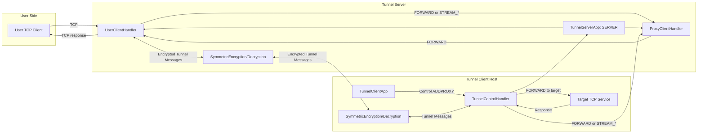
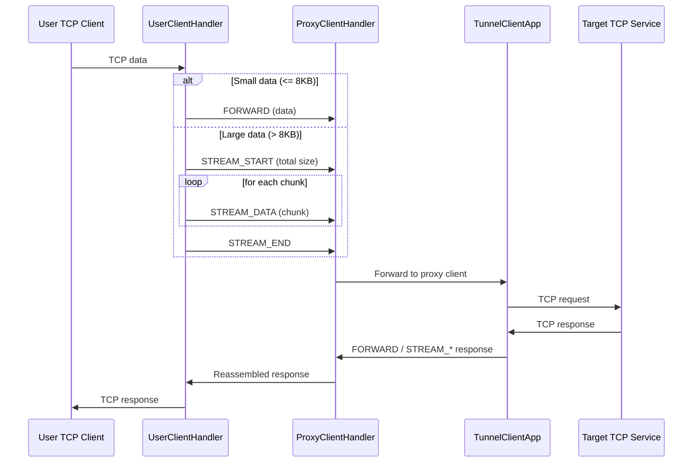
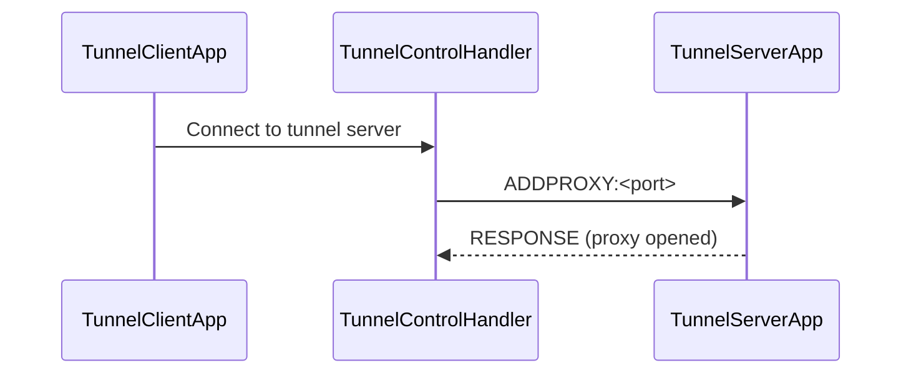

# Project Flow Diagram

```mermaid
flowchart LR
    subgraph UserSide[User Side]
        U[User TCP Client]
    end

    subgraph ServerSide[Tunnel Server]
        TS[TunnelServerApp: SERVER]
        UH[UserClientHandler]
        PH[ProxyClientHandler]
        SEC1[SymmetricEncryption/Decryption]
    end

    subgraph ClientSide[Tunnel Client Host]
        TC[TunnelClientApp]
        TCH[TunnelControlHandler]
        SEC2[SymmetricEncryption/Decryption]
        TARGET[Target TCP Service]
    end

    U -- TCP --> UH
    UH -->|FORWARD or STREAM_*| PH

    TS --> UH
    TS --> PH

    TC -->|Control ADDPROXY| TCH
    TCH --> TS

    UH <-->|Encrypted Tunnel Messages| SEC1
    SEC1 <-->|Encrypted Tunnel Messages| SEC2
    SEC2 <-->|Tunnel Messages| TCH

    TCH -->|FORWARD to target| TARGET
    TARGET -->|Response| TCH
    TCH -->|FORWARD or STREAM_*| PH
    PH -->|FORWARD| UH
    UH -->|TCP response| U
```

## Streaming vs Direct Transfer (User -> Proxy)

```mermaid
sequenceDiagram
    participant User as User TCP Client
    participant UH as UserClientHandler
    participant PH as ProxyClientHandler
    participant TC as TunnelClientApp
    participant Target as Target TCP Service

    User->>UH: TCP data
    alt Small data (<= 8KB)
        UH->>PH: FORWARD (data)
    else Large data (> 8KB)
        UH->>PH: STREAM_START (total size)
        loop for each chunk
            UH->>PH: STREAM_DATA (chunk)
        end
        UH->>PH: STREAM_END
    end
    PH->>TC: Forward to proxy client
    TC->>Target: TCP request
    Target->>TC: TCP response
    TC->>PH: FORWARD / STREAM_* response
    PH->>UH: Reassembled response
    UH->>User: TCP response
```

## Control Channel (Proxy Registration)

```mermaid
sequenceDiagram
    participant TC as TunnelClientApp
    participant TCH as TunnelControlHandler
    participant TS as TunnelServerApp

    TC->>TCH: Connect to tunnel server
    TCH->>TS: ADDPROXY:<port>
    TS-->>TCH: RESPONSE (proxy opened)
```
